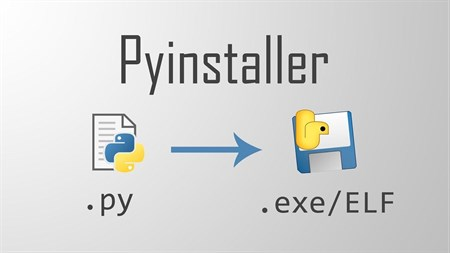

# ✋ SmartHand - Advanced AI Gesture Controller

Control your entire computer operating system using in-air, high-speed hand gestures! **SmartHand** uses a modern, state-of-the-art AI architecture capable of running at 60 FPS directly on standard laptop hardware.

> [!IMPORTANT]
> **💻 OS Compatibility:** SmartHand natively supports both **Windows** and **macOS**! Due to deep OS-level keyboard/mouse hooks, each operating system uses its own dedicated launcher script (`main.py` for Windows, `main_macos.py` for macOS). Linux support is currently experimental.

## 🚀 Features

- **Advanced AI Vision:** Completely migrated to Google's state-of-the-art **MediaPipe Tasks API**, running in a high-performance asynchronous `LIVE_STREAM` mode.
- **Hardware Accelerated:** Uses DirectShow (`cv2.CAP_DSHOW`) and `MJPG` compression on a decoupled 640x480 hardware capture pipeline. This allows the AI models to process video blazingly fast without bogging down your CPU, guaranteeing 60 FPS performance!
- **Hardware Agnostic HUD:** A dynamic, futuristic UI overlay tracks your real-time FPS, CPU utilization, RAM usage, and GPU load (using `psutil` and `GPUtil`, with graceful fallbacks for integrated Intel laptop GPUs).
- **Hold-To-Trigger Logic:** Prevent accidental clicks! Gestures must be intentionally held for a set amount of frames before executing, backed by a visual progress bar and a global cooldown timer.
- **Strict Dorsal Tracking:** The AI mathematically filters out your palm using cross-product vector math. Gestures will **ONLY** trigger when the **back of your hand** faces the camera, providing an extremely robust way to ignore accidental hand movements!
- **Multi-Hand Combo System:** You are no longer limited to one hand. Combine specific shapes on your Left Hand and Right Hand to unlock hidden hotkeys and exponential control combinations!
- **Global Toggles:** Instantly pause the entire camera system using the `'z'` key to save battery, or use your Left Pinky gesture to temporarily pause AI gesture tracking while keeping the camera live.

---

## ⚡ Performance & Hardware Optimization

SmartHand is specifically engineered to run at **true 30/60 FPS** with **zero latency**, even on older or budget hardware. We achieve this by bypassing standard computer vision bottlenecks:

- **Asynchronous Daemon Threading:** Standard OpenCV pipelines are notorious for buffering old video frames, which causes heavy lag (often dropping to ~12 FPS) while the AI processes. SmartHand bypasses this by running a custom background daemon thread that constantly flushes the camera buffer, guaranteeing the AI _always_ processes the most instantaneous, real-time frame.
- **Ultra-Low Memory Footprint (The "8GB Fix"):** By completely eliminating the OpenCV frame backlog, the application's RAM footprint stays incredibly small. Whether your laptop has **8GB, 16GB, or 32GB of RAM**, SmartHand guarantees zero memory leaks or bloat, making it 100% future-proof for any system!

---

## 🧠 The "60" Coincidence


When both your hands are on the screen, the AI tracks **42 physical landmarks** (21 joints per hand) in 3D space. By using these 42 landmarks, this application currently supports exactly **60 unique hand gestures** (15 Right, 15 Left, and 30 Dual-Hand combos) to control your PC!

## 🖐️ Gesture Map

> **Note:** A "Neutral" state (all fingers open or all fingers completely closed into a fist) on your dominant hand performs no actions.

### 📸 Reference Postures

> [!IMPORTANT]
> **Dorsal Angle Tracking:** To ensure maximum tracking accuracy, gestures will **only** trigger when the back of your hand (dorsal side) is facing the camera.

<table align="center">
  <tr>
    <td align="center">
      
    </td>
    <td align="center">
      <br><br><b>✋ Dorsal View Requirement</b>
    </td>
  </tr>
  <tr>
    <td align="center">
      <br><b>✅ Correct Hand Posture</b><br>
      <i>Maintain clear visibility of all fingers</i>
    </td>
    <td align="center">
      <br>
      <i>The AI mathematically filters out palm-facing gestures</i>
    </td>
  </tr>
</table>

### ➡️ Right Hand (Primary Controls)

| Gesture Shape                     | Action Triggered      |
| :-------------------------------- | :-------------------- |
| **Thumb + Index**                 | `Right Arrow`         |
| **Thumb + Index + Pinky**         | `Left Arrow`          |
| **Index Only**                    | `Space`               |
| **Middle Only**                   | `'z'` Key             |
| **Thumb + Index + Middle**        | `'m'` Key             |
| **Thumb Only**                    | `Enter`               |
| **Index + Middle**                | `Up Arrow`            |
| **Index + Pinky**                 | `Down Arrow`          |
| **Index + Middle + Ring**         | `Ctrl + F4`           |
| **Pinky Only**                    | `Ctrl + t`            |
| **4 Fingers (No Pinky)**          | `Ctrl + Win + Right`  |
| **4 Fingers (No Thumb)**          | `Ctrl + Alt + w`      |
| **Thumb + Middle + Ring + Pinky** | `Esc` Key             |
| **Thumb + Pinky**                 | `F5` Key (Refresh)    |
| **Thumb + Middle + Pinky**        | **Mouse Right-Click** |

### 🌐 Global Keyboard Overrides (Terminal/Window Focused)

| Key       | Action Triggered           |
| :-------- | :------------------------- |
| `'z'` Key | **Toggle Camera ON / OFF** |
| `'x'` Key | **Quit the Application**   |

### ⬅️ Left Hand (System Hotkeys)

| Gesture Shape                     | Action Triggered                      |
| :-------------------------------- | :------------------------------------ |
| **Index + Middle**                | `'f'` Key                             |
| **Thumb + Index**                 | `Shift + n`                           |
| **Thumb + Index + Pinky**         | `Shift + p`                           |
| **Index Only**                    | `F11` Key                             |
| **Middle Only**                   | `'x'` Key                             |
| **Thumb Only**                    | `Win + d` (Show Desktop)              |
| **Index + Middle + Ring**         | `Alt + F4` (Close Window)             |
| **Index + Pinky**                 | `Ctrl + Alt + Tab`                    |
| **4 Fingers (No Pinky)**          | `Ctrl + Win + Left`                   |
| **4 Fingers (No Thumb)**          | `Ctrl + Alt + c`                      |
| **Thumb + Middle + Pinky**        | **Mouse Left-Click**                  |
| **Thumb + Middle + Ring + Pinky** | `Ctrl + Shift + t`                    |
| **Thumb + Pinky**                 | `Ctrl + r`                            |
| **Thumb + Index + Middle**        | `Ctrl + Tab`                          |
| **Pinky Only**                    | **[TOGGLE] Pause/Resume AI Gestures** |

### 🤝 Multi-Hand Combos

| Left Hand                         | Right Hand                        | Action Triggered                    |
| :-------------------------------- | :-------------------------------- | :---------------------------------- |
| **Fist**                          | **Index**                         | `Win + 1`                           |
| **Fist**                          | **Index + Middle**                | `Win + 2`                           |
| **Fist**                          | **Index + Middle + Ring**         | `Win + 3`                           |
| **Fist**                          | **4 Fingers**                     | `Win + 4`                           |
| **Fist**                          | **Index + Pinky**                 | `Win`                               |
| **Fist**                          | **Thumb + Index + Pinky**         | `Win + r`                           |
| **Thumb + Index + Middle**        | **Index**                         | `Ctrl + Shift + 1`                  |
| **Thumb + Index + Middle**        | **Index + Middle**                | `Ctrl + Shift + 2`                  |
| **Thumb + Index + Middle**        | **Index + Middle + Ring**         | `Ctrl + Shift + 3`                  |
| **Thumb + Index + Middle**        | **4 Fingers (No Thumb)**          | `Ctrl + Shift + 4`                  |
| **Thumb + Index + Middle**        | **Index + Pinky**                 | `F1`                                |
| **Thumb + Index + Middle**        | **Thumb + Pinky**                 | `F1`                                |
| **Thumb + Index + Middle**        | **Thumb + Index + Pinky**         | `F1`                                |
| **Index**                         | **Index**                         | `Tab`                               |
| **Index**                         | **Index + Middle**                | `Tab` + `Tab` + `Tab` (Triple Tab)  |
| **Index + Middle**                | **Thumb + Index**                 | `Alt + Right Arrow`                 |
| **Index + Middle**                | **Thumb + Index + Pinky**         | `Alt + Left Arrow`                  |
| **Thumb + Middle**                | **Thumb + Middle**                | **[SHUTDOWN PC]**                   |
| **Thumb + Middle + Ring + Pinky** | **Thumb + Middle + Ring + Pinky** | **[LOCK PC]** `Win + l`             |
| **Thumb + Pinky**                 | **Thumb + Pinky**                 | `Ctrl + Shift + Esc` (Task Manager) |
| **Thumb + Middle + Pinky**        | **Thumb + Middle + Pinky**        | **[RESTART PC]**                    |
| **Index + Middle + Ring**         | **Index**                         | `Ctrl + c`                          |
| **Index + Middle + Ring**         | **Thumb + Index + Pinky**         | `Ctrl + Win + F4` (Close Desktop)   |
| **Index + Middle + Ring**         | **Index + Pinky**                 | **[MACRO] New Desktop Sequence**    |
| **Index + Middle + Ring**         | **Index + Middle**                | `Ctrl + x`                          |
| **Index + Middle + Ring**         | **Index + Middle + Ring**         | `Ctrl + v`                          |
| **Index + Middle + Ring**         | **4 Fingers (No Thumb)**          | `Ctrl + s`                          |
| **Middle + Ring + Pinky**         | **Index**                         | **[MACRO] Open CMD Sequence**       |
| **Middle + Ring + Pinky**         | **Index + Middle**                | **[MACRO] Open PowerShell Seq.**    |
| **Middle + Ring + Pinky**         | **Index + Middle + Ring**         | `Ctrl + Shift + Win + b`            |

### ⚙️ Global Keyboard Hotkeys

If you need to quickly manage the SmartHand application while running:

- **`z` Key:** Toggle Camera On/Off
- **`x` Key:** Quit SmartHand (must have the camera window focused)
- **`c` Key:** Flush Camera Buffer (Press this if the camera feed starts to lag, it instantly restores max FPS!)

---

## 📥 Quick Start (No Installation Required!)

The easiest way to use SmartHand on any Windows PC is to simply download the pre-built executable. You **do not** need to install Python or mess with the terminal!

1. Go to the **Releases** section on the right side of this GitHub repository page.
2. Download the latest `main.exe` file.
3. Right-click `main.exe` and select **"Run as administrator"** _(This is required for the hand gestures to control your keyboard globally!)_
   > [!CAUTION]
   > ⏳ **Please be patient!** The 3D AI models are very large, so it is completely normal for `main.exe` to take **10 to 20 seconds** to load and appear on your screen after clicking.

_(Note: Because this is a custom executable, Windows Defender might show a "Windows protected your PC" popup. Just click **More info** -> **Run anyway**)._

---

## 🍎 macOS Quick Start (Standalone App)

You can share the compiled macOS application (`SmartHand.app`) with friends so they don't need to install Python!

1. Share the `dist/SmartHand.app` folder with your friend.
2. Because the app is not signed by an Apple Developer account, macOS will show an "Unidentified Developer" warning if they double-click it.
3. **To bypass this:**
   - **Method A:** Right-click `SmartHand.app` in Finder, click **Open**, and click **Open** again in the security dialog.
   - **Method B (Terminal):** Run `xattr -d com.apple.quarantine /path/to/SmartHand.app` to remove the security block.
   - **Method C (Direct):** Open the terminal and run the executable directly: `./SmartHand.app/Contents/MacOS/SmartHand`.

---

## 💻 Developer Setup (Running from Source)

If you are a developer or want to modify the code from scratch, follow these exact steps:

**Step 1: Download or Transfer the Files**
If downloading from GitHub, click the green **Code -> Download ZIP** button on the repository page and extract the folder.
Alternatively, copy the entire `SmartHand` folder to the new computer via a USB drive or cloud storage.
_(Note: The `hand_landmarker.task` file is ~8MB and will be included automatically in the GitHub download. If sharing manually, you can safely delete the `dist` and `build` folders before sharing to save space, but you **MUST** include the `hand_landmarker.task` file as it contains the AI model!)_

**Step 2: Install Python**

1. Go to [python.org/downloads](https://www.python.org/downloads/) and download the latest version of Python for Windows _(Any recent version of Python 3 will work perfectly!)_.
2. Open the installer. **CRITICAL STEP:** Before clicking "Install Now", make sure to check the box at the bottom that says **"Add Python to PATH"**. If you forget this, the terminal commands won't work!
3. Click "Install Now" and wait for it to finish.
4. You can verify the installation by opening your terminal (or Command Prompt) and typing `python --version` to see the installed version.

**Step 3: Open the Terminal**

1. Open the `SmartHand` folder on the new computer.
2. Click on the address bar at the top of the file explorer, type `cmd`, and hit **Enter**. This will open a black terminal window directly inside that folder.

**Step 4: Install Dependencies**
In that black terminal window, copy and paste this command and hit Enter:

```bash
pip install -r requirements.txt
```

_This will download all the required AI models (MediaPipe, OpenCV) and control libraries (PyAutoGUI). It might take a minute or two._

**Step 5: Run the App!**
Once the installation finishes, you can start the application by typing:

```bash
py main.py
```

_(If that says command not found, try typing `python main.py` instead)._

That's it! The camera should light up and the AI gesture HUD will appear on the screen.

---

## 🍏 macOS Developer Setup (Running from Source)

The macOS version utilizes `pynput` instead of `pyautogui` for OS-level control.

**Step 1: Install Python 3.14 (or compatible 3.9+)**
Download Python for macOS. Ensure you are using the correct Python binary. _Warning for Anaconda users: Conda's base environment often overrides the `python3` command (e.g., pointing it to 3.9 instead of 3.14). To ensure you use the correct version, explicitly type `python3.14` or run `conda deactivate` first!_

**Step 2: Install Dependencies**
Open your terminal in the SmartHand folder and run:

```bash
python3.14 -m pip install -r requirements_macos.txt
```

**Step 3: Run the App!**

```bash
python3.14 main_macos.py
```

_(Note: The first launch takes 10-20 seconds to load the AI models into memory)._

---

## 📦 Building an Executable



To get started, you will need to install PyInstaller using Python's package manager (pip). Here are the quick steps to download and verify it:

### 📥 Installation Steps

Open your terminal or command prompt and run the following command:

```bash
pip install pyinstaller
```

### 🔍 Verify the Installation

To confirm it downloaded correctly and check the version, run:

```bash
pyinstaller --version
```

### 🪟 Windows (.exe)

To build the application into a standalone Windows `.exe` that doesn't require Python installation, simply run:

```powershell
.\rebuild.ps1
```

### 🍎 macOS (.app)

To bundle the application for macOS, use the provided shell script:

```bash
chmod +x build_macos.sh
./build_macos.sh
```

> [!TIP]
> **Crash Fix:** If your `.app` crashes upon double-clicking but works perfectly via the terminal, ensure your PyInstaller build script is using the `--onefile` flag instead of `--onedir`!
>
> **Custom Icon:** To add a custom icon, use Homebrew to install ImageMagick (`brew install imagemagick`), convert your PNG (`convert icon.png -define icon:auto-resize=256,128,96,64,48,32,16 SmartHand.icns`), and add `--icon=SmartHand.icns` to the PyInstaller command.

> [!CAUTION]
> ⏳ **Note:** This process bundles massive AI models and libraries into a single file. It is completely normal for this to take **4 to 5 minutes**. Do not close the terminal!

_The `hand_landmarker.task` AI model is automatically bundled directly into the executable/app by PyInstaller!_

---

## 📁 File Structure

This is the complete expected file structure for the SmartHand application:

```text
SmartHand/
├── main.py                 # The core Windows AI hand gesture control application script
├── main_macos.py           # The core macOS script (uses pynput instead of pyautogui)
├── hand_landmarker.task    # The Google MediaPipe 3D AI model (CRITICAL to run)
├── requirements.txt        # Windows Python dependencies
├── requirements_macos.txt  # macOS Python dependencies
├── run.ps1                 # Windows Developer quick-start script
├── run_macos.sh            # macOS Developer quick-start script
├── rebuild.ps1             # PowerShell script to compile main.py into a .exe
├── build_macos.sh          # Bash script to compile main_macos.py into a macOS .app
├── main.spec               # PyInstaller config for Windows
└── README.md               # This documentation file
```

---

## 🛠️ Troubleshooting & FAQ

### 1. The Looping/Crashing Issue (Opening and closing repeatedly)

When a python file is compiled into a standalone `.exe` using PyInstaller, it can get stuck in an infinite loop (spawning endless copies of itself) if the script uses `multiprocessing` either directly or indirectly (via libraries like `mediapipe`). Windows does not have a native `fork()` method, so child processes start by re-running the main script from the top.

**Fix:** We call `multiprocessing.freeze_support()` inside the `if __name__ == '__main__':` block. This tells PyInstaller to stop child processes from running the main code again.

### 2. The Pip Install Error (`error: externally-managed-environment`)

If you or a friend tries to run `pip install -r requirements.txt` and gets this error, it means you are using a Linux-like environment on Windows (specifically MSYS2 / MinGW Python or a newer Python version that strictly enforces PEP 668). This restricts installing packages globally to prevent breaking the system environment.

**Fix:** You have three options:

1. **Force the installation:** Run the pip install command with the `--break-system-packages` flag:
   ```cmd
   pip install -r requirements.txt --break-system-packages
   ```
2. **Use a Virtual Environment:** Create and activate a virtual environment before installing:
   ```cmd
   python -m venv venv
   .\venv\Scripts\activate
   pip install -r requirements.txt
   ```
3. **Install Standard Python:** Uninstall MSYS2 Python and download the normal Windows installer from the official website (python.org). The standard Windows installer doesn't have this restriction by default.

### 3. FPS Drops & Memory Leaks

If the camera feed starts to lag, pressing the **`c`** key will flush the camera buffer and instantly restore max FPS. Under the hood, this also calls `gc.collect()` to manually force Python's Garbage Collector to free up any lingering memory from OpenCV or MediaPipe buffers!

### 4. Does my friend need to install PyInstaller or Python?

**No.** Since you are compiling the code into a standalone `.exe` file, your friend doesn't need to install PyInstaller, Python, or any packages at all. That's the magic of PyInstaller—it bundles everything the program needs into that single `.exe` file! Just send them the executable and they can double-click to run it.
